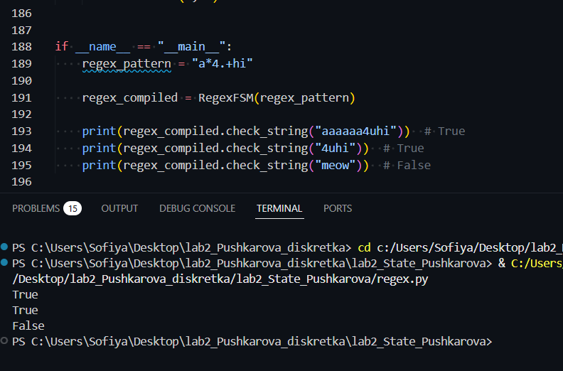

# Лабораторна робота №2: Реалізація регулярних виразів через скінченний автомат (FSM)

В цій лабораторній роботі - код для перевірки відповідності рядків заданому регулярному виразу.

Програма підтримує роботу зі звичайними символами (ASCII), крапкою `.` (будь-який символ), а також квантифікаторами `*` (0 або більше повторень) та `+` (1 або більше повторень).

---

## Опис архітектури та логіки роботи

Усі елементи автомата представлені у вигляді окремих класів-станів, які успадковуються від базового класу `State`:

1. **`AsciiState`** - відповідає за розпізнавання конкретного символу (літери або цифри).
2. **`DotState`** - приймає будь-який символ на вхід.
3. **`StarState` (`*`)** - обгортає інший стан, дозволяючи йому повторюватися 0 або більше разів.
4. **`PlusState` (`+`)** - обгортає стан, вимагаючи його повторення щонайменше 1 раз.
5. **`StartState`** - початковий стан автомата.

### Алгоритм перевірки рядка (`check_string`)
Під час створення автомата всі стани вишикуються в послідовний ланцюжок (pipeline). Для перевірки відповідності вхідного тексту використовується алгоритм **DFS (пошук у глибину)**:

* Якщо на шляху зустрічається **`StarState`**, алгоритм розгалужується: пробує пропустити цей стан (сценарій 0 повторень) або збігтися з поточним символом і залишитися в цьому ж стані для перевірки наступних літер.
* Якщо зустрічається **`PlusState`**, алгоритм спочатку вимагає успішної перевірки одного обов'язкового символу, а далі обробляє його за принципом зірочки.
* Якщо обраний шлях обходу призводить до невідповідності символів, спрацьовує механізм повернення назад (backtracking), і алгоритм перевіряє інші можливі гілки переходів.
* Рядок вважається успішно пройденим (`True`), якщо після повного обходу ланцюжка станів був повністю зчитаний вхідний текст.

---

## Інструкція із запуску

Для запуску проєкту потрібен встановлений Python 3.

1. Завантажте файл `regex.py`.
2. Відкрийте термінал у папці з файлом.
3. Виконайте команду:

```bash
python regex.py


### Результати тестування

Для перевірки роботи програми використовувався шаблон регулярного виразу `a*4.+hi`.

| Вхідний рядок | Очікуваний результат | Фактичний результат | Пояснення |
| :--- | :---: | :---: | :--- |
| `"aaaaaa4uhi"` | `True` | `True` | Символи `a` повторилися, далі йде обов'язкова `4`, будь-який символ `u`, та правильний кінець `hi`. |
| `"4uhi"` | `True` | `True` | Відсутність символів `a` допускається квантифікатором `*`. |
| `"meow"` | `False` | `False` | Текст повністю не відповідає заданому шаблону. |

### Вивід програми у консоль:

```text
True
True
False
\```


### Скріншот виконання тестів у терміналі VS Code:


